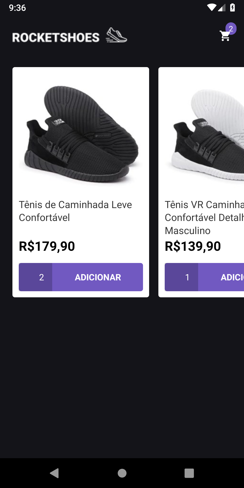

# RocketShoes Mobile:rocket:
React Native e-commerce project developed on [RocketSeat GoStack Bootcamp](https://rocketseat.com.br/bootcamp). Check the [Web version](https://github.com/rafacdomin/rocketshoes-web) made with ReacJS. 

## About
This project is a simple e-commerce where you can choose products and add they to the cart, changing the amount and seeing the subtotal and total price of the actual order.

### Layout

<h1>
  
  
  
</h1>

### Technologies
This project was developed with the following technologies: 

-  [ReactNative](https://reactnative.dev/)
-  [Redux](https://redux.js.org/)
-  [Redux-Saga](https://redux-saga.js.org/)
-  [React Navigation v5](https://reactnavigation.org/)
-  [Axios](https://github.com/axios/axios)
-  [Immer](https://github.com/immerjs/immer)
-  [Intl](https://www.npmjs.com/package/intl)
-  [styled-components](https://www.styled-components.com/)
-  [react-native-vector-icons](https://github.com/oblador/react-native-vector-icons)
-  [json-server](https://github.com/typicode/json-server)
-  [Reactotron](https://infinite.red/reactotron)


## How To Use
To clone and run this application, you'll need [Git](https://git-scm.com), [Node.js](https://nodejs.org/) + [Yarn v1](https://classic.yarnpkg.com/) installed on your computer and a Android Device or Emulator. From your command line:

```bash
# Clone this repository
$ git clone https://github.com/rafacdomin/rocketshoes-mobile

# Go into the repository
$ cd rocketshoes-mobile

# Install dependencies
$ yarn install

# Start the metro server
$ npx react-native start

# Run the app
$ npx react-native run-android
```

## Author


Made with :heart: by Rafael Domingues :wave: [Get in touch!](https://www.linkedin.com/in/rafaelcodomingues/)

[](https://www.linkedin.com/in/rafaelcodomingues/) 
[](mailto:rafaelcodomingues@gmail.com)
